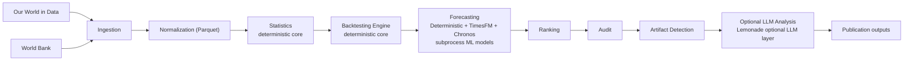

# ContinuityBreakDetector

[](https://github.com/Patrice-Gaudicheau/ContinuityBreakDetector/actions/workflows/test.yml)

ContinuityBreakDetector is a deterministic-first pipeline for finding candidate continuity breaks in long-term public time-series data. It ingests source data, normalizes it into yearly series, computes transparent statistical signals, runs historical backtests, ranks cross-domain anomalies, audits likely causes, and filters data artifacts before any optional ML or LLM interpretation is used.

## Architecture



## Key Idea

The scientific path is deterministic through artifact filtering. Optional TimesFM, Chronos, and Lemonade components can add forecasting or interpretation, but they do not replace the auditable core.

Every major stage writes local artifacts and metadata so a reviewer can inspect what happened:

- raw retrieval metadata
- normalized Parquet time series
- statistical features
- forecast errors
- ranked break candidates
- candidate audits
- data artifact audits
- reproducibility metadata

## Quick Demo

```bash
python -m pip install -e '.[test]'
make demo-study
```

`make demo-study` runs an end-to-end deterministic study from embedded fixture data in seconds. It does not use network access, TimesFM, Chronos, or Lemonade.

The demo writes outputs under:

```text
studies/demo_study/
```

## Pipeline Overview

- **Ingestion**: fetches public-source data and stores raw responses with metadata.
- **Normalization**: converts source-specific payloads into a common yearly schema.
- **Statistics**: computes growth, log growth, acceleration, rolling z-scores, and break scores.
- **Backtesting**: evaluates whether future values became difficult to predict from prior windows.
- **Ranking**: groups anomalies into cross-domain candidate break years.
- **Audit**: checks robustness, model agreement, source coverage, sparsity, and known explanations.
- **Artifact detection**: flags likely data artifacts, source dominance, extreme statistical values, and model echoes.
- **Publication outputs**: produces compact reports and optional draft material from deterministic results.

## Features

- Deterministic baseline forecasting: `naive_last_value`, `linear_trend`, `exponential_trend`
- Optional advanced forecasters isolated in subprocess workers
- Optional local LLM interpretation through a Lemonade-compatible endpoint
- File-based, inspectable pipeline using Parquet and JSON artifacts
- CLI entrypoint: `cbd`
- CI with Ruff and pytest
- 60+ tests covering normalization, statistics, backtesting, ranking, audit, artifacts, forecasting adapters, and publication helpers
- No committed raw data, generated studies, secrets, model checkpoints, or local caches

## Data Sources

Currently supported source integrations:

- World Bank datasets
- Our World in Data
- OpenAlex
- arXiv
- Crossref

The source layer is designed for additional public-data connectors using the same ingestion and normalization pattern. Examples of compatible future integrations include OECD, Eurostat, IEA, Energy Institute / BP datasets, Maddison, UN World Population Prospects, GitHub public activity data, and Dimensions.

See:

- [docs/data_sources.md](docs/data_sources.md)
- [docs/sources_connection_detail.md](docs/sources_connection_detail.md)

## Advanced Components

The advanced components are optional and isolated from the deterministic core.

| Component | Role | Isolation |
| --- | --- | --- |
| TimesFM | Neural time-series forecasting | Subprocess worker via `CBD_TIMESFM_PYTHON` |
| Chronos | Probabilistic time-series forecasting | Subprocess worker via `CBD_CHRONOS_PYTHON` |
| Lemonade | Local LLM interpretation reports | OpenAI-compatible local HTTP endpoint |

If an optional model is unavailable, the deterministic pipeline still runs.

```bash
python main.py list_forecasters
python main.py backtest_advanced
python main.py analyze_agents --study-path studies/backtests/<study_id>
```

## Example Outputs

Committed examples:

- [examples/sample_summary.json](examples/sample_summary.json)
- [examples/sample_artifact_audit.json](examples/sample_artifact_audit.json)
- [examples/sample_report.md](examples/sample_report.md)

Generated outputs:

```text
data/raw/
data/processed/
studies/backtests/
studies/demo_study/
publication/paper/
```

Generated outputs are intentionally ignored by Git.

## Why This Project Matters

Long-run public datasets contain real shocks, methodology changes, sparse historical coverage, source revisions, and model failures. A raw anomaly score is not enough.

ContinuityBreakDetector shows how to structure this kind of analysis so claims remain inspectable: deterministic computation first, artifact review before interpretation, optional ML/LLM layers kept outside the core method, and reproducible artifacts at every step.

The current conclusion is cautious: the pipeline detects known real-world shocks and likely data artifacts, but does not claim causal proof or an unexplained synchronized cross-domain break.

## Limitations

- The pipeline identifies statistical candidates, not causes.
- Artifact filtering assigns risk indicators, not definitive labels.
- Optional TimesFM and Chronos runs require separate local model environments.
- Optional Lemonade reports are interpretive aids, not scientific evidence.
- Public API schemas, coverage, and rate limits can change.
- Broader claims require more data sources, source-level validation, and independent replication.

## License

No license file is currently included.
