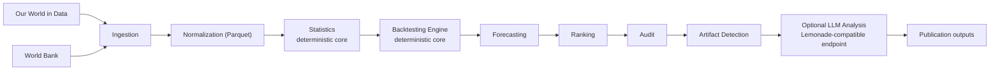

# ContinuityBreakDetector

[](https://github.com/Patrice-Gaudicheau/ContinuityBreakDetector/actions/workflows/test.yml)
[](https://github.com/Patrice-Gaudicheau/ContinuityBreakDetector/actions/workflows/test.yml)

ContinuityBreakDetector is not a typical anomaly detector.

It is a deterministic analysis pipeline followed by a structured AI review layer, built around a simple idea: AI as reviewer, not as decision maker.

It ingests long-run public time series, computes statistical features, runs rolling backtests, ranks candidate continuity breaks, and filters likely artifacts. All these stages are deterministic, reproducible, and fully inspectable.

The system does not rely on AI for detection. LLMs are introduced only after the analytical pipeline, where they interpret, challenge, and contextualize the results through a set of specialized agents: source auditor, statistical reviewer, domain_interpreter, skeptic, and synthesis.

This design separates computation from interpretation. The pipeline produces evidence. The agents behave like a committee of reviewers.

The core project remains intentionally lightweight. Optional TimesFM and Chronos forecasting runs are isolated in Docker workers, and optional LLM analysis runs through a Lemonade-compatible endpoint.

## Architecture

```text
public data -> deterministic core -> audit artifacts -> reports
```



For design details, see [ARCHITECTURE.md](ARCHITECTURE.md) and the
[ML architecture notes](docs/ml_architecture.md).

## Key Idea

The system is built around a strict two-layer architecture.

The first layer is deterministic. It produces evidence: forecast errors, ranked
candidates, audit scores, artifact flags, and reproducibility metadata.

The second layer is interpretative. A structured set of agents reads those
artifacts and produces a critical review.

The domain_interpreter is a key component of this layer. Its role is to connect
statistically detected breaks to plausible real-world context, economic,
demographic, or scientific, without overriding the underlying evidence.

The skeptic agent plays an equally important role by actively rejecting false
positives and favoring ordinary explanations over speculative ones.

Together, these agents form a constrained interpretation system rather than a
generative one.

## Quick Demo

```bash
python -m pip install -e '.[test]'
make demo-study
```

`make demo-study` runs an end-to-end deterministic study from embedded fixture data in seconds. It does not use network access, TimesFM, Chronos, or Lemonade.

The demo writes outputs under:

```text
studies/demo_study/
```

## Testing

```bash
pytest -q
ruff check .
mypy continuity_break_detector
```

Coverage can be measured locally with:

```bash
pytest --cov=continuity_break_detector --cov-report=term-missing
```

## Lightweight Docker

Build the core reproducibility image:

```bash
docker build -t continuity-break-detector:core .
```

Run the test suite inside Docker:

```bash
docker run --rm continuity-break-detector:core
```

This container is intentionally lightweight and installs the project with its
test dependencies only. It does not contain TimesFM, Chronos, model weights, or
GPU requirements.

## Optional ML Forecasting

Advanced models such as TimesFM and Chronos run in isolated Docker workers. They
are optional and do not add ML dependencies to the core Python environment.

Use this quickstart for setup and commands:

- [docs/ml_quickstart.md](docs/ml_quickstart.md)

Architecture and contract details:

- [ARCHITECTURE.md](ARCHITECTURE.md)
- [docs/ml_architecture.md](docs/ml_architecture.md)
- [docs/worker_contract.md](docs/worker_contract.md)
- [docs/roadmap.md](docs/roadmap.md)

## Pipeline Overview

- **Ingestion**: fetches public-source data and stores raw responses with metadata.
- **Normalization**: converts source-specific payloads into a common yearly schema.
- **Statistics**: computes growth, log growth, acceleration, rolling z-scores, and break scores.
- **Backtesting**: evaluates whether future values became difficult to predict from prior windows.
- **Ranking**: groups anomalies into cross-domain candidate break years using heuristic weights documented in [docs/scoring.md](docs/scoring.md).
- **Audit**: checks robustness, model agreement, source coverage, sparsity, and known explanations.
- **Artifact detection**: flags likely data artifacts, source dominance, extreme statistical values, and model echoes using heuristic scoring subject to tuning.
- **Publication outputs**: produces compact reports and optional draft material from deterministic results.

## Features

- Deterministic baseline forecasting: `naive_last_value`, `linear_trend`, `exponential_trend`
- Optional advanced forecasters isolated in Docker workers
- Optional local LLM interpretation through a Lemonade-compatible endpoint
- File-based, inspectable pipeline using Parquet and JSON artifacts
- CLI entrypoint: `cbd`
- CI with Ruff, mypy, and pytest
- 140+ tests covering normalization, statistics, backtesting, ranking, audit, artifacts, forecasting adapters, and publication helpers
- No committed raw data, generated studies, secrets, model checkpoints, or local caches

## Data Sources

Currently supported source integrations:

- World Bank datasets
- Our World in Data
- OpenAlex
- arXiv
- Crossref

The source layer is designed for additional public-data connectors using the same ingestion and normalization pattern. Examples of compatible future integrations include OECD, Eurostat, IEA, Energy Institute / BP datasets, Maddison, UN World Population Prospects, GitHub public activity data, and Dimensions.

See:

- [docs/data_sources.md](docs/data_sources.md)
- [docs/sources_connection_detail.md](docs/sources_connection_detail.md)

## Advanced Components

The advanced components are optional and isolated from the deterministic core.

| Component | Role | Isolation |
| --- | --- | --- |
| TimesFM | Neural time-series forecasting | Docker worker via `timesfm-worker` |
| Chronos | Probabilistic time-series forecasting | Docker worker via `chronos-worker` |
| Lemonade | Local LLM interpretation reports | OpenAI-compatible local HTTP endpoint |

If an optional model is unavailable, the deterministic pipeline still runs.

```bash
python main.py list_forecasters
python main.py backtest_advanced
python main.py analyze_agents --study-path studies/backtests/<study_id>
```

## Example Outputs

Committed examples:

- [examples/sample_summary.json](examples/sample_summary.json)
- [examples/sample_artifact_audit.json](examples/sample_artifact_audit.json)
- [examples/sample_report.md](examples/sample_report.md)

Generated outputs:

```text
data/raw/
data/processed/
studies/backtests/
studies/demo_study/
publication/paper/
```

Generated outputs are intentionally ignored by Git.

## Why This Project Matters

Long-run public datasets contain real shocks, methodology changes, sparse historical coverage, source revisions, and model failures. A raw anomaly score is not enough.

ContinuityBreakDetector shows how to structure this kind of analysis so claims remain inspectable: deterministic computation first, artifact review before interpretation, optional ML/LLM layers kept outside the core method, and reproducible artifacts at every step.

The current conclusion is cautious: the pipeline detects known real-world shocks and likely data artifacts, but does not claim causal proof or an unexplained synchronized cross-domain break.

## Related Article

A detailed write-up of the analysis behind this project is available here:

- [docs/article_continuity_breaks.md](docs/article_continuity_breaks.md)

This article focuses on the data analysis and results, while this repository focuses on the implementation and pipeline design.

## Limitations

- The pipeline identifies statistical candidates, not causes.
- Artifact filtering assigns risk indicators, not definitive labels.
- Optional TimesFM and Chronos runs require Docker and may download model weights
  into the Hugging Face cache volume at runtime.
- Optional Lemonade reports are interpretive aids, not scientific evidence.
- Public API schemas, coverage, and rate limits can change.
- Broader claims require more data sources, source-level validation, and independent replication.

## License

This project is licensed under the MIT License.
