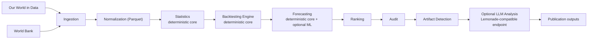

# ContinuityBreakDetector

[](https://github.com/Patrice-Gaudicheau/ContinuityBreakDetector/actions/workflows/test.yml)

ContinuityBreakDetector is a deterministic-first pipeline for finding continuity
break candidates in long-run public time series. It combines source ingestion,
normalization, statistical feature generation, rolling backtests, candidate
ranking, and artifact review into an inspectable local workflow.

The core project is intentionally ML-free. Optional TimesFM and Chronos
forecasting runs are available through isolated Docker workers, but the
statistical detector, demo study, tests, and publication artifacts do not depend
on those model packages.

This repository is primarily an engineering project. The article provides
context and results, not the implementation.

## Architecture

```text
public data -> deterministic core -> audit artifacts -> reports
                                  \
                                   -> optional ForecastClient -> Docker ML workers
```



The ML path is a side path, not a dependency of the detector:

```text
core CLI
  -> ForecastClient
  -> DockerForecastClient
  -> docker compose run --rm -T <worker> python predict.py
  -> JSON stdout parsed with continuity_break_detector.prediction_schema
```

## Key Idea

The scientific path is deterministic through artifact filtering. Optional TimesFM, Chronos, and Lemonade components can add forecasting or interpretation, but they do not replace the auditable core.

Every major stage writes local artifacts and metadata so a reviewer can inspect what happened:

- raw retrieval metadata
- normalized Parquet time series
- statistical features
- forecast errors
- ranked break candidates
- candidate audits
- data artifact audits
- reproducibility metadata

## Quick Demo

```bash
python -m pip install -e '.[test]'
make demo-study
```

`make demo-study` runs an end-to-end deterministic study from embedded fixture data in seconds. It does not use network access, TimesFM, Chronos, or Lemonade.

The demo writes outputs under:

```text
studies/demo_study/
```

## Lightweight Docker

Build the core reproducibility image:

```bash
docker build -t continuity-break-detector:core .
```

Run the test suite inside Docker:

```bash
docker run --rm continuity-break-detector:core
```

This container is intentionally lightweight and installs the project with its
test dependencies only. It does not contain TimesFM, Chronos, model weights, or
GPU requirements.

## Optional ML Worker Containers

The Docker Compose setup keeps the deterministic core image separate from
optional ML worker images:

- `core` reuses the lightweight `python:3.12-slim` project Dockerfile and runs the existing test command by default.
- `timesfm-worker` uses its own `python:3.11-slim` image with the TimesFM environment.
- `chronos-worker` uses its own `python:3.11-slim` image with the Chronos environment.

Build all images:

```bash
docker compose build
```

Run the core tests and worker readiness commands:

```bash
docker compose up
```

Run import-level ML smoke tests inside the worker containers:

```bash
docker compose run --rm timesfm-worker python smoke_test.py
docker compose run --rm chronos-worker python smoke_test.py
```

The Compose default is intentionally lightweight:

- Docker core tests run the deterministic project test suite in the `core` container.
- ML worker readiness checks only verify that the worker containers start.
- ML smoke tests verify library imports and small CPU tensor operations.
- Full model smoke tests may download model weights and run inference, so they are opt-in at runtime:

```bash
CBD_RUN_ML_MODEL_SMOKE=1 docker compose run --rm timesfm-worker python smoke_test.py
CBD_RUN_ML_MODEL_SMOKE=1 docker compose run --rm chronos-worker python smoke_test.py
```

The ML worker containers are optional. They prepare isolated CPU Python
environments and do not download model weights during build.

The core CLI can invoke the same isolated worker smoke tests without installing ML
dependencies in the core environment:

```bash
python -m continuity_break_detector.main ml-smoke
python -m continuity_break_detector.main ml-smoke --worker timesfm
python -m continuity_break_detector.main ml-smoke --worker chronos
```

These commands run the lightweight import and CPU tensor smoke tests by default.
Full model smoke tests remain opt-in and may download model weights at runtime:

```bash
python -m continuity_break_detector.main ml-smoke --full
```

The worker containers also expose stable JSON prediction commands. They read one
JSON object from stdin and write one JSON object to stdout; logs and model
download messages go to stderr.

```bash
echo '{"series":[1,2,3,4],"horizon":1}' | docker compose run --rm -T timesfm-worker python predict.py
echo '{"series":[1,2,3,4],"horizon":1}' | docker compose run --rm -T chronos-worker python predict.py
```

The same contract is available through the core CLI while keeping TimesFM and
Chronos isolated in Docker:

```bash
python -m continuity_break_detector.main ml-predict --worker timesfm --series "1,2,3,4" --horizon 1
python -m continuity_break_detector.main ml-predict --worker chronos --series "1,2,3,4" --horizon 1
```

The first prediction run may download model weights at runtime. The core Python
environment still does not install or import ML worker dependencies.

Experimental daemon mode keeps a worker process alive for repeated predictions
within one command:

```bash
python -m continuity_break_detector.main ml-daemon-predict --worker timesfm --series "1,2,3,4" --horizon 3 --repeat 3
python -m continuity_break_detector.main ml-daemon-predict --worker chronos --series "1,2,3,4" --horizon 3 --repeat 3
```

Daemon mode uses newline-delimited JSON over stdin/stdout. It does not start an
HTTP server and is intended for future batch/backtest workloads.

Internally, ML predictions go through `ForecastClient`. The first implementation,
`DockerForecastClient`, owns the Docker Compose JSON stdin/stdout path used by
`ml-predict`, `predict-series`, and `analyze-series`. The experimental
`DockerWarmForecastClient` starts `daemon.py` in a worker container and sends
newline-delimited JSON requests over stdin/stdout so a model can stay loaded
within one session. One-shot prediction remains the default.

The request and response contract is centralized in
`continuity_break_detector.prediction_schema`. The core client, worker
`predict.py` scripts, and pipeline commands share those validation helpers so
the JSON stdin/stdout shape stays consistent across backends.

More detail:

- [docs/ml_architecture.md](docs/ml_architecture.md)
- [docs/worker_contract.md](docs/worker_contract.md)
- [docs/roadmap.md](docs/roadmap.md)

Docker Compose mounts a shared named volume, `hf_cache`, at
`/root/.cache/huggingface` in both ML worker containers. The first full smoke or
prediction run downloads model weights into that volume at runtime; later runs
reuse the cached files instead of baking weights into images or requiring host
path configuration. To intentionally clear the model cache:

```bash
docker compose down -v
```

For pipeline-level use, `predict-series` reads a JSON file with a required
`series` list and optional `metadata` object, invokes an isolated Docker ML
worker, and prints one structured JSON response:

```json
{
  "series": [1.0, 2.0, 3.0, 4.0],
  "metadata": {
    "name": "demo_series"
  }
}
```

```bash
python -m continuity_break_detector.main predict-series --worker timesfm --input examples/series.json --horizon 3 --mode one-shot
python -m continuity_break_detector.main predict-series --worker chronos --input examples/series.json --horizon 3 --mode daemon
```

The default mode is `one-shot`, which preserves the existing behavior. The
experimental `daemon` mode uses `DockerWarmForecastClient` for a warm worker
session. The workers remain optional Docker backends. The first run may populate
the Hugging Face cache volume; normal deterministic workflows do not require
these models.

`analyze-series` extends `predict-series` by appending the ML forecast to the
historical input and running the existing structural break scoring adapter over
the combined historical-plus-forecast series:

```bash
python -m continuity_break_detector.main analyze-series --worker timesfm --input examples/series.json --horizon 3 --mode one-shot
python -m continuity_break_detector.main analyze-series --worker chronos --input examples/series.json --horizon 3 --mode daemon
```

This command returns the forecast and a compact continuity-break analysis in one
JSON object. The ML models remain optional Docker-backed components, and the
first run may populate the Hugging Face cache volume.

## Command Dependencies

Commands that do not require Docker or ML packages:

- `make demo-study`
- `pytest -q`
- deterministic pipeline commands such as `ingest`, `normalize`,
  `compute_statistics`, `rank_breaks`, `audit_candidates`, and
  `detect_artifacts`

Commands that require Docker when using the current ML backend:

- `ml-smoke`
- `ml-predict`
- `ml-daemon-predict`
- `predict-series`
- `analyze-series`
- direct `docker compose run ... predict.py` worker calls

Full model smoke tests and first prediction runs may populate the Hugging Face
cache volume. Regular deterministic workflows do not.

## Pipeline Overview

- **Ingestion**: fetches public-source data and stores raw responses with metadata.
- **Normalization**: converts source-specific payloads into a common yearly schema.
- **Statistics**: computes growth, log growth, acceleration, rolling z-scores, and break scores.
- **Backtesting**: evaluates whether future values became difficult to predict from prior windows.
- **Ranking**: groups anomalies into cross-domain candidate break years using heuristic weights documented in [docs/scoring.md](docs/scoring.md).
- **Audit**: checks robustness, model agreement, source coverage, sparsity, and known explanations.
- **Artifact detection**: flags likely data artifacts, source dominance, extreme statistical values, and model echoes using heuristic scoring subject to tuning.
- **Publication outputs**: produces compact reports and optional draft material from deterministic results.

## Features

- Deterministic baseline forecasting: `naive_last_value`, `linear_trend`, `exponential_trend`
- Optional advanced forecasters isolated in Docker workers
- Optional local LLM interpretation through a Lemonade-compatible endpoint
- File-based, inspectable pipeline using Parquet and JSON artifacts
- CLI entrypoint: `cbd`
- CI with Ruff, mypy, and pytest
- 60+ tests covering normalization, statistics, backtesting, ranking, audit, artifacts, forecasting adapters, and publication helpers
- No committed raw data, generated studies, secrets, model checkpoints, or local caches

## Data Sources

Currently supported source integrations:

- World Bank datasets
- Our World in Data
- OpenAlex
- arXiv
- Crossref

The source layer is designed for additional public-data connectors using the same ingestion and normalization pattern. Examples of compatible future integrations include OECD, Eurostat, IEA, Energy Institute / BP datasets, Maddison, UN World Population Prospects, GitHub public activity data, and Dimensions.

See:

- [docs/data_sources.md](docs/data_sources.md)
- [docs/sources_connection_detail.md](docs/sources_connection_detail.md)

## Advanced Components

The advanced components are optional and isolated from the deterministic core.

| Component | Role | Isolation |
| --- | --- | --- |
| TimesFM | Neural time-series forecasting | Docker worker via `timesfm-worker` |
| Chronos | Probabilistic time-series forecasting | Docker worker via `chronos-worker` |
| Lemonade | Local LLM interpretation reports | OpenAI-compatible local HTTP endpoint |

If an optional model is unavailable, the deterministic pipeline still runs.

```bash
python main.py list_forecasters
python main.py backtest_advanced
python main.py analyze_agents --study-path studies/backtests/<study_id>
```

## Example Outputs

Committed examples:

- [examples/sample_summary.json](examples/sample_summary.json)
- [examples/sample_artifact_audit.json](examples/sample_artifact_audit.json)
- [examples/sample_report.md](examples/sample_report.md)

Generated outputs:

```text
data/raw/
data/processed/
studies/backtests/
studies/demo_study/
publication/paper/
```

Generated outputs are intentionally ignored by Git.

## Why This Project Matters

Long-run public datasets contain real shocks, methodology changes, sparse historical coverage, source revisions, and model failures. A raw anomaly score is not enough.

ContinuityBreakDetector shows how to structure this kind of analysis so claims remain inspectable: deterministic computation first, artifact review before interpretation, optional ML/LLM layers kept outside the core method, and reproducible artifacts at every step.

The current conclusion is cautious: the pipeline detects known real-world shocks and likely data artifacts, but does not claim causal proof or an unexplained synchronized cross-domain break.

## Related Article

A detailed write-up of the analysis behind this project is available here:

- [docs/article_continuity_breaks.md](docs/article_continuity_breaks.md)

This article focuses on the data analysis and results, while this repository focuses on the implementation and pipeline design.

## Limitations

- The pipeline identifies statistical candidates, not causes.
- Artifact filtering assigns risk indicators, not definitive labels.
- Optional TimesFM and Chronos runs require Docker and may download model weights
  into the Hugging Face cache volume at runtime.
- Optional Lemonade reports are interpretive aids, not scientific evidence.
- Public API schemas, coverage, and rate limits can change.
- Broader claims require more data sources, source-level validation, and independent replication.

## License

This project is licensed under the MIT License.
