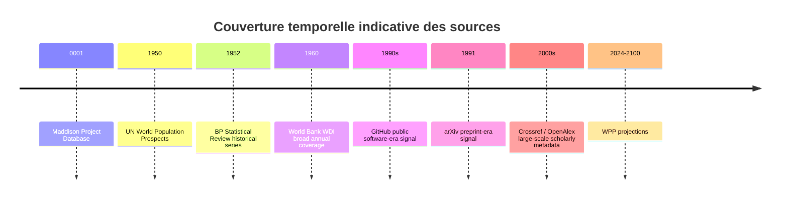

# Catalogue technique des connexions de données pour ContinuityBreakDetector

## Résumé exécutif

Pour un POC fiable et automatisable de détection de ruptures de continuité, les connecteurs les plus solides, au sens “documentation officielle + accès machine stable + schéma récupérable sans reverse engineering”, sont aujourd’hui : World Bank WDI, OECD SDMX, OpenAlex, arXiv, Crossref et l’API Chart d’Our World in Data. Ces sources offrent soit des API publiques explicites, soit des schémas de téléchargement documentés, avec pagination et formats de réponse suffisamment clairs pour une implémentation directe. citeturn8view0turn8view2turn12view0turn6view0turn13search0turn13search1turn14search1turn16view0turn16view1turn24view1turn24view2turn44view0turn44view1

Les sources suivantes restent utiles mais demandent plus de prudence côté intégration : Maddison Project Database, Eurostat, GitHub, UN Population Division, BP Statistical Review / Energy Institute et IEA. Le problème n’est pas la valeur analytique des données, mais l’hétérogénéité des modalités d’accès : ZIP/XLSX plutôt qu’API, chemins de téléchargement moins stables, documentation partiellement orientée interface web, ou détails techniques nécessaires non totalement exposés dans les pages officielles récupérées ici. Quand un point n’est pas explicitement documenté dans les sources officielles consultées, il est marqué “undocumented”. citeturn30view0turn30view1turn3search0turn3search1turn3search4turn3search6turn20search0turn20search1turn22search3turn34search3turn39search0turn1search8turn1search9turn1search13

## Tableau comparatif rapide

| Source | Access type | Auth | Rate limits | Format principal | Priorité | Docs |
|---|---|---|---|---|---:|---|
| World Bank WDI | free | none | undocumented | JSON, XML, ZIP/CSV | 5 | citeturn8view0turn8view2turn12view0turn4search0 |
| OECD SDMX | free | none | documented but exact values undocumented in retrieved page | SDMX-JSON, XML, CSV | 5 | citeturn6view0turn4search1turn4search5 |
| OpenAlex | free | optional `api_key` | 100 req/s; free daily budget shown in docs | JSON | 5 | citeturn13search0turn13search1turn14search1turn14search2 |
| arXiv API | free | none | 1 req / 3 sec; 1 connection | Atom XML | 4 | citeturn16view0turn16view1turn17view1turn18view1 |
| BP / EI Statistical Review | free | none | undocumented | XLSX/PDF, CSV undocumented | 2 | citeturn1search8 |
| IEA public aggregates | freemium | account/session | undocumented | Dotstat / downloadable files | 2 | citeturn1search9turn1search13 |
| GitHub public activity | free | none or token optional | documented, exact core/search values not captured here | JSON | 3 | citeturn20search0turn20search1turn22search2turn22search3 |
| Maddison Project Database | free | none | none documented | XLSX, DTA, ZIP | 5 | citeturn30view0turn30view1 |
| UN Population Division API | free | none | undocumented | JSON, CSV | 3 | citeturn34search0turn34search2turn34search3 |
| UN WPP bulk files | free | none | none documented | CSV, XLSX | 5 | citeturn39search0turn40search1 |
| OWID Chart API | free | none | undocumented | CSV, JSON, ZIP | 5 | citeturn44view0turn44view3 |
| Crossref REST API | free / paid | none, `mailto`, or API token | Public 5 / polite 10 / plus 150; concurrency 1 / 3 / none | JSON | 5 | citeturn24view1turn24view2turn28search0turn28search2 |
| Dimensions | paid | institutional / API | undocumented publicly; API subscription-only | DSL API / BigQuery open datasets | 1 | citeturn2search3turn2search7turn2search27 |
| Eurostat | free | none | undocumented in retrieved snippets | JSON-stat, SDMX JSON/XML/CSV | 4 | citeturn3search0turn3search1turn3search4turn3search6turn3search9turn3search11turn3search19 |

## Catalogue détaillé

### World Bank WDI

TITLE: World Development Indicators API  
NAME: World Bank  
CATEGORY: economics / demographics / other  
DESCRIPTION: API officielle de la Banque mondiale pour interroger les indicateurs WDI et d’autres bases d’indicateurs. La v2 expose séries temporelles, métadonnées d’indicateurs et téléchargements ZIP/CSV.  
ACCESS_TYPE: free  
LICENSE: `CC BY 4.0` + addition contractuelle “mandatory and binding addition” sur les datasets World Bank ; voir `https://data.worldbank.org/summary-terms-of-use` et `https://www.worldbank.org/en/about/legal/terms-of-use-for-datasets`  
API_AVAILABLE: yes  
API_DOC_URL: `https://datahelpdesk.worldbank.org/knowledgebase/articles/889392-about-the-indicators-api-documentation`  
BASE_URL: `https://api.worldbank.org/v2`  
AUTHENTICATION: none  
RATE_LIMITS: undocumented. citeturn8view0turn8view2turn12view0turn4search0turn4search4

IMPLEMENTATION_METHOD:
```text
REQUEST_1:
  METHOD: GET
  URL: https://api.worldbank.org/v2/country/all/indicator/SP.POP.TOTL?format=json&per_page=1000&page=1
  HEADERS:
    Accept: application/json
  REQUIRED_PARAMS:
    country = "all" or "usa;fra;deu"
    indicator = e.g. "SP.POP.TOTL"
    format = "json"
  OPTIONAL_PARAMS:
    date = "1960:2024"
    per_page = 1000
    page = 1

RESPONSE_JSON:
  root[0]:
    page
    pages
    per_page
    total
    sourceid
    lastupdated
  root[1][]:
    indicator.id
    indicator.value
    country.id
    country.value
    countryiso3code
    date
    value
    unit
    obs_status
    decimal

PAGINATION:
  loop page from 1 to root[0].pages
  stop when page > pages

EXTRA_METADATA_ENDPOINTS:
  GET https://api.worldbank.org/v2/indicators/NY.GDP.MKTP.CD?format=json
  GET https://api.worldbank.org/v2/source/2/indicator/NY.GDP.MKTP.CD?format=json

DOWNLOAD_CSV_ZIP:
  GET https://api.worldbank.org/v2/country/ind/indicator/SI.POV.DDAY?source=2&downloadformat=csv

EXTRACTION_STEPS:
  1. fetch page 1
  2. read pagination metadata from root[0]
  3. flatten root[1] into rows
  4. append indicator_code, country_iso3, year, value

NORMALIZATION:
  - cast date -> int year when annual
  - cast value -> float
  - keep null values as NULL, not 0
  - preserve decimal field for display precision only
  - use countryiso3code as canonical geo key

RECOMMENDED_STORAGE:
  parquet table wdi_observations(
    source_id string,
    indicator_code string,
    indicator_name string,
    country_iso3 string,
    country_name string,
    year int,
    value double,
    unit string,
    obs_status string,
    decimal int,
    last_updated date
  )
```
citeturn8view2turn12view0

DATA_QUALITY_NOTES: couverture très longue, mais valeurs nulles fréquentes et révisions régulières ; certaines séries ont des fréquences non annuelles ; l’ordre de tri n’est pas contrôlable côté API. citeturn8view0turn8view2

USE_CASE_FOR_RAPID_INFLUX: WDI sert de socle pour détecter changements de régime sur population, PIB, urbanisation, énergie ou infrastructures. Les ruptures de pente, hausses anormales ou convergences rapides se testent très bien sur ces séries pays-années homogénéisées. citeturn8view0turn12view0

PRIORITY_SCORE: 5

### OECD SDMX

TITLE: OECD Data Explorer API (SDMX)  
NAME: OECD  
CATEGORY: economics / demographics / science / technology / other  
DESCRIPTION: API SDMX officielle de l’OECD Data Explorer, adaptée aux requêtes de données et de structure. Elle fournit CSV, JSON ou XML et une syntaxe documentée de sélection par dimensions.  
ACCESS_TYPE: free  
LICENSE: `OECD Terms and Conditions` ; redistribution et continuité de service gouvernées par ces conditions, pas par une licence de type CC explicitement indiquée sur la page API consultée  
API_AVAILABLE: yes  
API_DOC_URL: `https://www.oecd.org/en/data/insights/data-explainers/2024/09/api.html`  
BASE_URL: `https://sdmx.oecd.org/public/rest`  
AUTHENTICATION: none  
RATE_LIMITS: rate limiting documented, exact numeric values undocumented in retrieved official page. citeturn6view0turn4search1turn4search5

IMPLEMENTATION_METHOD:
```text
STRUCTURE_DISCOVERY:
  METHOD: GET
  URL: https://sdmx.oecd.org/public/rest/dataflow/all
  HEADERS:
    Accept: application/xml

DATA_REQUEST_TEMPLATE:
  METHOD: GET
  URL: https://sdmx.oecd.org/public/rest/data/{agency_id},{dataset_id},{dataset_version}/{selection}?startPeriod={start}&endPeriod={end}&format=csvfilewithlabels&dimensionAtObservation=AllDimensions
  REQUIRED_PARAMS:
    agency_id = e.g. OECD.SDD.STES
    dataset_id = dataset from dataflow
    dataset_version = optional; leave blank for latest
    selection = "all" or dimension filters with "." and "+"
  EXAMPLE:
    https://sdmx.oecd.org/public/rest/data/OECD.SDD.STES,DSD_STES@DF_CLI/.M.LI...AA...H?startPeriod=2023-02&dimensionAtObservation=AllDimensions&format=csvfilewithlabels

JSON_FORMAT_OPTION:
  add format=jsondata

XML_FORMAT_OPTION:
  add format=genericdata

EXTRACTION_STEPS:
  1. GET /dataflow/all to discover available flows
  2. use structure query from Data Explorer or flow metadata to obtain dimension order
  3. request CSV with labels for simplest ingestion
  4. persist returned dimension columns + observation value column

PAGINATION:
  undocumented in retrieved page for standard CSV responses
  for very large responses, API may switch to asynchronous delivery per Eurostat-like SDMX behavior? NO: for OECD page, not documented in retrieved snippet
  treat as one-shot per filtered selection

NORMALIZATION:
  - parse time period strings as yearly / quarterly / monthly depending on frequency dimension
  - preserve original dimension codes and label columns
  - cast numeric observation column to double
  - store frequency separately
  - do not collapse dimension order; it is dataset-specific

RECOMMENDED_STORAGE:
  parquet table oecd_observations(
    flow_id string,
    dimension_tuple string,
    frequency string,
    time_period string,
    obs_value double,
    raw_row json
  )
```
citeturn6view0

DATA_QUALITY_NOTES: excellente qualité structurelle, mais chaque dataflow possède son propre ordre de dimensions ; il faut toujours interroger la structure avant d’automatiser une extraction. La page officielle avertit aussi que les nouvelles versions de dataflows peuvent introduire des changements non rétrocompatibles. citeturn6view0

USE_CASE_FOR_RAPID_INFLUX: l’OCDE est idéale pour repérer des changements de régime fins sur cycles économiques, prix, production, marché du travail, R&D ou innovation, avec granularités mensuelles et trimestrielles. Cela complète les séries annuelles WDI pour détecter des accélérations brutales à haute fréquence. citeturn6view0

PRIORITY_SCORE: 5

### OpenAlex

TITLE: OpenAlex REST API  
NAME: OpenAlex  
CATEGORY: science / technology  
DESCRIPTION: catalogue ouvert de la recherche mondiale, couvrant works, authors, sources, institutions, topics, etc. API moderne documentée, cursor paging, filtres, group_by et snapshots ouverts.  
ACCESS_TYPE: free  
LICENSE: `CC0`  
API_AVAILABLE: yes  
API_DOC_URL: `https://developers.openalex.org/api-reference/introduction`  
BASE_URL: `https://api.openalex.org`  
AUTHENTICATION: optional `api_key` as query parameter; API key free  
RATE_LIMITS: `100 requests/second`; budget gratuit quotidien exposé dans `/rate-limit`; `per_page` max `100`; paging simple limité à `10,000` résultats puis cursor mandatory. citeturn13search0turn13search1turn14search1turn14search2turn4search2turn4search18

IMPLEMENTATION_METHOD:
```text
LIST_WORKS:
  METHOD: GET
  URL: https://api.openalex.org/works?filter=publication_year:2020&per_page=100&cursor=*&api_key=YOUR_KEY
  HEADERS:
    Accept: application/json

OPTIONAL_FILTERS:
  filter=publication_year:2020
  filter=doi:10.1234/a|10.1234/b
  group_by=type
  select=id,doi,publication_year,publication_date,type,cited_by_count

RESPONSE_JSON:
  meta.count
  meta.page
  meta.per_page
  meta.next_cursor
  meta.cost_usd
  results[].id
  results[].doi
  results[].title
  results[].display_name
  results[].publication_year
  results[].publication_date
  results[].type
  results[].language
  results[].cited_by_count
  results[].is_retracted
  results[].is_paratext
  results[].primary_location.is_oa
  results[].primary_location.source.id
  results[].authorships[]
  results[].primary_topic

PAGINATION:
  start with cursor=*
  read meta.next_cursor
  repeat until next_cursor is null and results is empty

GROUP_BY_EXAMPLE:
  GET https://api.openalex.org/works?filter=publication_year:2023&group_by=type

RATE_LIMIT_STATUS:
  GET https://api.openalex.org/rate-limit?api_key=YOUR_KEY

NORMALIZATION:
  - parse publication_date -> date
  - use publication_year as partition column
  - retain id and doi as separate identifiers
  - flatten authorships to child table if needed
  - treat cited_by_count as current snapshot metric, not historical count at publication date

RECOMMENDED_STORAGE:
  parquet table openalex_works(
    openalex_id string,
    doi string,
    title string,
    publication_year int,
    publication_date date,
    type string,
    language string,
    cited_by_count int,
    is_retracted bool,
    is_paratext bool,
    source_id string,
    is_oa bool,
    primary_topic_id string,
    raw_json json
  )
```
citeturn14search2turn14search3turn14search1turn13search1

DATA_QUALITY_NOTES: excellente couverture, mais `cited_by_count` est un instantané actuel et non une série historique native ; pour des analyses temporelles de citations, il faut reconstituer des snapshots. Les filtres OR sont limités à 100 valeurs par filtre. citeturn13search1turn14search10

USE_CASE_FOR_RAPID_INFLUX: OpenAlex permet de mesurer l’accélération de la production scientifique, la diversification thématique et la diffusion institutionnelle des travaux. Les groupements par type, année et sujets sont particulièrement adaptés à la détection de discontinuités cognitives ou technologiques. citeturn13search0turn13search3

PRIORITY_SCORE: 5

### arXiv

TITLE: arXiv API  
NAME: arXiv  
CATEGORY: science / technology  
DESCRIPTION: API historique d’arXiv pour la recherche et la récupération de métadonnées en temps réel, avec réponses Atom XML. arXiv recommande OAI-PMH pour les récoltes massives de métadonnées.  
ACCESS_TYPE: free  
LICENSE: métadonnées réutilisables ; les métadonnées d’arXiv sont décrites comme `CC0` dans la documentation associée au Plan S ; licences de contenus variables selon article  
API_AVAILABLE: yes  
API_DOC_URL: `https://info.arxiv.org/help/api/user-manual.html`  
BASE_URL: `http://export.arxiv.org/api`  
AUTHENTICATION: none  
RATE_LIMITS: `one request every three seconds` et `single connection at a time` pour les legacy APIs ; `max_results` limité à `30000`, en tranches de `2000`. citeturn16view0turn16view1turn16view2turn17view1turn18view1turn18view3turn4search19

IMPLEMENTATION_METHOD:
```text
SEARCH_REQUEST:
  METHOD: GET
  URL: http://export.arxiv.org/api/query?search_query=all:electron&start=0&max_results=2000&sortBy=submittedDate&sortOrder=ascending
  HEADERS:
    Accept: application/atom+xml

PARAMETERS:
  search_query = lucene-like arXiv query
  id_list = comma-separated arXiv ids
  start = 0-based index
  max_results = <= 2000 per slice, total <= 30000
  sortBy = relevance | lastUpdatedDate | submittedDate
  sortOrder = ascending | descending

RESPONSE_XML_FIELDS:
  feed/updated
  feed/opensearch:totalResults
  feed/opensearch:startIndex
  feed/opensearch:itemsPerPage
  feed/entry/id
  feed/entry/title
  feed/entry/published
  feed/entry/updated
  feed/entry/summary
  feed/entry/author/name
  feed/entry/author/arxiv:affiliation
  feed/entry/category[@term]
  feed/entry/arxiv:primary_category[@term]
  feed/entry/arxiv:comment
  feed/entry/arxiv:journal_ref
  feed/entry/arxiv:doi
  feed/entry/link[@rel='alternate' or @title='pdf']

PAGINATION:
  start=0
  increment start by max_results
  stop when start >= totalResults or returned entries < max_results
  sleep 3 seconds between calls

NORMALIZATION:
  - parse published and updated as timestamps
  - collect multiple authors and categories into child tables or arrays
  - normalize arXiv id from entry/id URL
  - use primary_category as main subject code
  - keep DOI nullable

RECOMMENDED_STORAGE:
  sqlite or parquet:
    arxiv_entries(
      arxiv_id string,
      title string,
      published_ts timestamp,
      updated_ts timestamp,
      summary string,
      primary_category string,
      doi string,
      journal_ref string,
      comment string,
      raw_xml text
    )
```
citeturn16view0turn17view1turn17view2turn17view3turn18view1turn18view3turn18view4

DATA_QUALITY_NOTES: excellent pour la latence de diffusion scientifique, mais la taxonomie est propre à arXiv et les licences de plein texte ne sont pas uniformes. Pour la moisson complète des métadonnées, arXiv recommande OAI-PMH plutôt que l’API de recherche. citeturn16view2turn16view1

USE_CASE_FOR_RAPID_INFLUX: arXiv est un signal précoce extrêmement utile pour détecter des vagues d’afflux scientifique, en particulier en physique, mathématiques, informatique et IA. Les changements brusques du volume de prépublications ou de certaines catégories donnent un marqueur quasi temps réel de rupture de régime cognitif. citeturn16view0turn16view2

PRIORITY_SCORE: 4

### BP Statistical Review / Energy Institute

TITLE: Statistical Review of World Energy data files  
NAME: BP legacy site / Energy Institute  
CATEGORY: energy  
DESCRIPTION: la Statistical Review est la série historique de référence de BP jusqu’en 2022 ; le site officiel BP renvoie désormais vers la continuité “Energy Institute Statistical Review”. Dans les pages récupérées ici, le mode d’accès machine n’est pas exposé comme une API.  
ACCESS_TYPE: free  
LICENSE: undocumented in retrieved official pages  
API_AVAILABLE: no  
API_DOC_URL: `https://www.bp.com/en/global/corporate/energy-economics.html`  
BASE_URL: undocumented  
AUTHENTICATION: none  
RATE_LIMITS: undocumented. citeturn1search8turn1search12

IMPLEMENTATION_METHOD:
```text
SOURCE_STRATEGY:
  1. open official landing page:
     https://www.bp.com/en/global/corporate/energy-economics.html
  2. locate latest "Statistical Review" data file link from HTML
  3. prefer XLSX or ZIP package if offered
  4. convert workbook tabs to canonical CSV/Parquet locally

AUTOMATION_PATTERN:
  METHOD: GET landing page
  PARSE: href values containing "statistical-review" and file suffix [.xlsx, .zip, .csv, .pdf]
  DOWNLOAD: latest machine-readable file
  VERIFY: checksum/hash pinning by release

EXTRACTION:
  - build one normalized long table with columns:
    release_year, sheet_name, entity, year, variable, value, unit
  - preserve original workbook sheet name for auditability

NORMALIZATION:
  - harmonize year as int
  - keep units from source sheet headers
  - standardize country/entity naming with ISO mapping table
  - document BP->Energy Institute continuity break in metadata
```
citeturn1search8

DATA_QUALITY_NOTES: très forte utilité analytique sur énergie fossile/électricité, mais risque opérationnel supérieur car le point d’entrée machine officiel n’est pas décrit comme API dans les pages récupérées. Transition BP → Energy Institute à documenter dans le lineage. citeturn1search8

USE_CASE_FOR_RAPID_INFLUX: utile pour tester la montée rapide de la consommation d’énergie primaire, des renouvelables, ou des substitutions de mix sur le long terme. C’est un excellent proxy des ruptures matérielles sous-jacentes aux accélérations techno-économiques. citeturn1search8

PRIORITY_SCORE: 2

### IEA public aggregates

TITLE: IEA public data products and free aggregates  
NAME: International Energy Agency  
CATEGORY: energy  
DESCRIPTION: l’IEA publie des produits de données structurés, dont certains gratuits mais derrière compte, souvent accessibles via Dotstat. Les pages officielles récupérées ici documentent surtout les produits, pas un endpoint public stable non authentifié.  
ACCESS_TYPE: freemium  
LICENSE: undocumented in retrieved official pages  
API_AVAILABLE: no  
API_DOC_URL: `https://www.iea.org/data-and-statistics/data-product/world-energy-balances`  
BASE_URL: undocumented  
AUTHENTICATION: account / web session for free datasets requiring sign-in  
RATE_LIMITS: undocumented. citeturn1search9turn1search13

IMPLEMENTATION_METHOD:
```text
SOURCE_STRATEGY:
  PRODUCT_1 = https://www.iea.org/data-and-statistics/data-product/world-energy-balances
  PRODUCT_2 = https://www.iea.org/data-and-statistics/data-product/world-energy-outlook-2025-free-dataset

WORKFLOW:
  1. access product page
  2. if page says "Access on Dotstat", follow dotstat export/download workflow
  3. if sign-in is required, use service account / browser session and download allowed CSV/XLSX
  4. store raw files verbatim, then normalize to long table

NORMALIZED_SCHEMA:
  iea_energy(
    product string,
    scenario string,
    entity string,
    year int,
    variable string,
    value double,
    unit string,
    source_release string
  )

OPERATIONAL_NOTE:
  exact direct API/download endpoint not documented in retrieved official snippets
  pin downloaded artifacts by release date and checksum
```
citeturn1search9turn1search13

DATA_QUALITY_NOTES: qualité énergétique très élevée, mais accès public inégal selon produit. Pour un POC, traiter l’IEA comme source à ingestion “artifact-based” plutôt qu’“API-first”. citeturn1search9turn1search13

USE_CASE_FOR_RAPID_INFLUX: excellent pour tester les ruptures d’intensité énergétique, de mix par scénario, ou de découplage énergie/PIB. Très utile si le POC veut distinguer accélération réelle et simple requalification statistique. citeturn1search9turn1search13

PRIORITY_SCORE: 2

### GitHub public activity metrics

TITLE: GitHub REST API for public repository activity  
NAME: GitHub  
CATEGORY: technology  
DESCRIPTION: API REST versionnée couvrant événements publics, commits et statistiques de dépôt. Les endpoints publics sont lisibles sans authentification pour ressources publiques ; certains graphiques de trafic exigent des droits d’écriture.  
ACCESS_TYPE: free  
LICENSE: subject to GitHub terms; exact redistribution clause not captured in retrieved official snippets  
API_AVAILABLE: yes  
API_DOC_URL: `https://docs.github.com/en/rest`  
BASE_URL: `https://api.github.com`  
AUTHENTICATION: none for many public endpoints; token optional for higher rate limits / additional endpoints  
RATE_LIMITS: documented by GitHub, but exact numeric values for core/search limits were not captured in the retrieved official snippets; search endpoints have custom stricter limits; inspect `/rate_limit`. citeturn19search8turn20search0turn20search2turn22search2turn22search3turn21search6

IMPLEMENTATION_METHOD:
```text
PUBLIC_EVENTS:
  METHOD: GET
  URL: https://api.github.com/events?per_page=100&page=1
  HEADERS:
    Accept: application/vnd.github+json
    X-GitHub-Api-Version: 2026-03-10

REPO_COMMITS:
  METHOD: GET
  URL: https://api.github.com/repos/{owner}/{repo}/commits?per_page=100&page=1
  HEADERS:
    Accept: application/vnd.github+json
    X-GitHub-Api-Version: 2026-03-10

REPO_STATS:
  METHOD: GET
  URL: https://api.github.com/repos/{owner}/{repo}/stats/commit_activity
  HEADERS:
    Accept: application/vnd.github+json
    X-GitHub-Api-Version: 2026-03-10

PAGINATION:
  - use per_page and page where supported
  - follow Link header when present

SPECIAL_BEHAVIOR:
  - repository statistics may return HTTP 202 while GitHub computes cached stats
  - retry after delay until 200

RATE_LIMIT_STATUS:
  METHOD: GET
  URL: https://api.github.com/rate_limit

EXTRACTION:
  - public events connector: extract common fields available in event payloads; exact common response schema not fully surfaced in retrieved snippets
  - commits connector: extract commit timestamp and repo identity
  - stats connector: use weekly aggregates if 200 response

RECOMMENDED_STORAGE:
  parquet tables:
    github_events_raw(...)
    github_repo_commit_activity(...)
    github_commits(...)
```
citeturn20search1turn20search3turn22search3turn21search5turn21search6

DATA_QUALITY_NOTES: les endpoints publics sont excellents pour signaux technologiques, mais la couverture “globale” de GitHub exige soit un échantillonnage de dépôts, soit des stratégies de recherche/indexation qui se heurtent plus vite aux limites. Les endpoints de trafic ne conviennent pas à un POC global. citeturn19search1turn20search0turn22search3

USE_CASE_FOR_RAPID_INFLUX: GitHub donne un proxy direct de l’activité de production logicielle et de la diffusion des briques techniques. Même un POC basé sur un panier de dépôts clés peut révéler des accélérations non linéaires dans certaines familles de technologies. citeturn20search1turn22search3

PRIORITY_SCORE: 3

### Maddison Project Database

TITLE: Maddison Project Database 2023  
NAME: Groningen Growth and Development Centre / DataverseNL  
CATEGORY: economics  
DESCRIPTION: base historique de PIB, PIB par tête et population au très long cours. La diffusion officielle se fait via Dataverse et via la page officielle du GGDC, sous formats Excel et Stata.  
ACCESS_TYPE: free  
LICENSE: `CC BY 4.0`; avec exigence supplémentaire de citer les papiers originaux lorsque les données sont montrées sous forme graphique ou quand on travaille sur des sous-ensembles de moins de 12 pays  
API_AVAILABLE: no  
API_DOC_URL: `https://www.rug.nl/ggdc/historicaldevelopment/maddison/releases/maddison-project-database-2023?lang=en`  
BASE_URL: `https://dataverse.nl/dataset.xhtml?persistentId=doi:10.34894/INZBF2`  
AUTHENTICATION: none  
RATE_LIMITS: none documented. citeturn30view0turn30view1

IMPLEMENTATION_METHOD:
```text
LANDING_PAGE:
  https://dataverse.nl/dataset.xhtml?persistentId=doi:10.34894/INZBF2

FILES_AVAILABLE:
  mpd2023_web.xlsx
  maddison2023_web.dta

WORKFLOW:
  1. download XLSX (preferred for generic ETL) or DTA
  2. read main data sheet into dataframe
  3. preserve source sheet and metadata sheet separately
  4. convert to long parquet

EXTRACTION:
  - exact column names are file-defined and not enumerated in retrieved page text
  - minimum expected fields for POC:
      country/entity
      year
      GDP
      GDP per capita
      population
  - verify against workbook schema at ingest time

NORMALIZATION:
  - cast year -> int
  - cast numeric measures -> double
  - map entity names to ISO where possible
  - preserve original variable names from workbook
  - add release_version = 2023

RECOMMENDED_STORAGE:
  parquet table maddison_long(
    entity string,
    iso3 string,
    year int,
    variable string,
    value double,
    release_version string,
    raw_source_file string
  )
```
citeturn30view0turn30view1

DATA_QUALITY_NOTES: source incontournable pour les longues durées, mais historique reconstruit et révisé, donc à traiter comme estimation savante et non observation brute. Très important de geler la release utilisée. citeturn30view0turn30view1

USE_CASE_FOR_RAPID_INFLUX: Maddison est clé pour tester si l’accélération contemporaine est réellement sans précédent à l’échelle séculaire. C’est probablement la meilleure base pour le versant “très long terme” du POC sur PIB et population. citeturn30view0turn30view1

PRIORITY_SCORE: 5

### UN Population Division API

TITLE: UN Population Division Data Portal API  
NAME: United Nations Population Division  
CATEGORY: demographics  
DESCRIPTION: API du portail de démographie de la Division de la population, exposant listes d’indicateurs et récupération de données par indicateur, lieu, année, âge, variante, sexe et catégorie. Les pages officielles récupérées ici montrent les points d’entrée principaux, mais une partie de la doc est rendue côté client.  
ACCESS_TYPE: free  
LICENSE: dataset-specific license undocumented in retrieved official snippets  
API_AVAILABLE: yes  
API_DOC_URL: `https://population.un.org/dataportalapi/index.html`  
BASE_URL: `https://population.un.org/dataportalapi/api/v1`  
AUTHENTICATION: none  
RATE_LIMITS: undocumented. citeturn34search0turn34search2turn34search3

IMPLEMENTATION_METHOD:
```text
DISCOVER_INDICATORS:
  METHOD: GET
  URL: https://population.un.org/dataportalapi/api/v1/indicators?format=csv&sort=name

DATA_ENDPOINT:
  exact official path for full data retrieval is documented in the interactive API index,
  but not fully expanded in the retrieved static snippets.
  official docs state data can be returned for:
    Indicators
    Locations
    StartYear
    EndYear
    StartAge
    EndAge
    Variants
    Sexes
    Categories

MINIMUM_WORKFLOW:
  1. fetch indicators list
  2. identify indicator IDs from the catalog
  3. build data request from interactive API documentation for the chosen indicator and location set
  4. ingest JSON or CSV depending endpoint option

RESPONSE:
  official search snippet confirms a 'Data' response object
  exact JSON field paths beyond that are undocumented in retrieved static snippets

NORMALIZATION:
  - store indicator id and label
  - distinguish estimate vs projection variant where applicable
  - parse age bounds and sex as dimensions, not attributes
  - keep years as int
```
citeturn34search0turn34search2turn34search3

DATA_QUALITY_NOTES: la valeur scientifique est élevée, mais la documentation récupérable sans exécution web est moins exploitable que pour World Bank ou OpenAlex. Pour un POC, privilégier soit ce connecteur avec validation manuelle initiale, soit les fichiers bulk WPP ci-dessous. citeturn34search0turn34search3

USE_CASE_FOR_RAPID_INFLUX: source centrale pour détecter ruptures de dynamique démographique, transitions de fécondité, vieillissement, ou chocs de structure par âge. Elle complète utilement WDI dès qu’on a besoin d’une granularité démographique plus fine. citeturn34search0turn34search4

PRIORITY_SCORE: 3

### UN World Population Prospects bulk files

TITLE: World Population Prospects bulk downloads  
NAME: United Nations Population Division  
CATEGORY: demographics  
DESCRIPTION: le site WPP 2024 recommande explicitement le format CSV pour les usages “database form or statistical software”. C’est l’option la plus robuste pour un POC batch sur population, projections et expositions démographiques.  
ACCESS_TYPE: free  
LICENSE: `CC BY 3.0 IGO` explicitement visible pour le rapport méthodologique ; licence dataset-specific bulk files not fully captured in retrieved snippets  
API_AVAILABLE: no  
API_DOC_URL: `https://population.un.org/wpp/`  
BASE_URL: `https://population.un.org/wpp/`  
AUTHENTICATION: none  
RATE_LIMITS: none documented. citeturn39search0turn40search1

IMPLEMENTATION_METHOD:
```text
ENTRYPOINT:
  https://population.un.org/wpp/

WORKFLOW:
  1. open WPP 2024 download section
  2. choose CSV bulk download as recommended by the site for database/statistical use
  3. download required standard files plus metadata workbook(s)
  4. ingest as long tables and freeze release date

KNOWN_OFFICIAL_REFERENCE_FROM_METHODOLOGY_DOC:
  metadata workbook pattern:
  https://population.un.org/wpp/Download/Files/4_Metadata/WPP2024_F01_LOCATIONS.XLSX

EXTRACTION:
  - load CSV bulk files into dataframe
  - load locations metadata workbook for code mapping and aggregate definitions
  - preserve estimate/projection variant dimensions
  - use release year 2024 and revision tag in all downstream tables

NORMALIZATION:
  - years as int
  - separate entity code, sex, variant, age group
  - never merge historical estimates and alternative variants without explicit label
  - mirror official aggregate lists from metadata workbook

RECOMMENDED_STORAGE:
  parquet tables:
    wpp_population(...)
    wpp_demographic_indicators(...)
    wpp_locations_metadata(...)
```
citeturn39search0turn40search1

DATA_QUALITY_NOTES: référence mondiale officielle mais partiellement projectionnelle ; la distinction historique/projection/variant doit être structurante dans le schéma. Très utile pour un pipeline batch, moins pour requêtes ad hoc fines. citeturn39search0turn40search1

USE_CASE_FOR_RAPID_INFLUX: indispensable pour tester l’hypothèse d’un emballement démographique ou son inversion. Permet de comparer ordre de grandeur, vitesse et synchronisation régionale sur 1950–2100. citeturn39search0turn40search1

PRIORITY_SCORE: 5

### Our World in Data Chart API

TITLE: OWID Grapher Chart API  
NAME: Our World in Data  
CATEGORY: energy / science / demographics / other  
DESCRIPTION: API la plus simple d’OWID : chaque graphique de `grapher` peut être appelé directement en `.csv`, `.metadata.json` ou `.zip`. Très pratique pour un POC data-driven orienté séries agrégées.  
ACCESS_TYPE: free  
LICENSE: `CC BY 4.0` au niveau API ; certaines données non redistribuables retournent `403`  
API_AVAILABLE: yes  
API_DOC_URL: `https://docs.owid.io/projects/etl/api/chart-api/`  
BASE_URL: `https://ourworldindata.org`  
AUTHENTICATION: none  
RATE_LIMITS: undocumented. citeturn44view0turn44view3

IMPLEMENTATION_METHOD:
```text
GET_FULL_CSV:
  METHOD: GET
  URL: https://ourworldindata.org/grapher/{slug}.csv

GET_METADATA:
  METHOD: GET
  URL: https://ourworldindata.org/grapher/{slug}.metadata.json

GET_ZIP:
  METHOD: GET
  URL: https://ourworldindata.org/grapher/{slug}.zip

FILTERED_CSV_EXAMPLE:
  METHOD: GET
  URL: https://ourworldindata.org/grapher/life-expectancy.csv?csvType=filtered&country=USA&time=2000..2020

EXAMPLE_RESPONSE_CSV:
  Entity,Code,Year,Period life expectancy at birth - Sex: all - Age: 0
  United States,USA,2000,76.64
  United States,USA,2010,78.54
  United States,USA,2020,77.28

METADATA_JSON_FIELDS:
  chart.title
  chart.subtitle
  chart.citation
  chart.originalChartUrl
  chart.selection
  ... additional chart configuration fields

EXTRACTION_STEPS:
  1. identify slug from OWID chart URL
  2. download .csv and .metadata.json pair
  3. parse CSV columns Entity, Code, Year + indicator columns
  4. reshape to long format if multi-indicator chart
  5. attach metadata JSON to dataset registry

NORMALIZATION:
  - Entity -> canonical entity label
  - Code -> ISO3 or OWID code
  - Year -> int
  - indicator column names -> normalized variable list
  - handle 403 as non-redistributable asset and skip

RECOMMENDED_STORAGE:
  parquet table owid_chart_long(
    slug string,
    entity string,
    code string,
    year int,
    variable string,
    value double,
    metadata_json json
  )
```
citeturn44view0

DATA_QUALITY_NOTES: ingestion très simple mais attention au fait que certaines séries sont des traitements OWID de sources externes ; toujours conserver `.metadata.json` pour citer l’origine, l’unité et les notes de processing. citeturn44view0turn44view3

USE_CASE_FOR_RAPID_INFLUX: parfait pour un POC rapide sur énergie, publications, CO₂, internet, etc., sans écrire de connecteurs lourds. Permet de tester vite des hypothèses de ruptures sur des séries déjà harmonisées et annotées. citeturn44view0turn44view3

PRIORITY_SCORE: 5

### Crossref REST API

TITLE: Crossref REST API  
NAME: Crossref  
CATEGORY: science  
DESCRIPTION: API REST publique de métadonnées bibliographiques enrichies, utile pour DOIs, types de documents, dates de création/mise à jour et volumes de travaux. Le mode “polite” est fortement recommandé via `mailto`.  
ACCESS_TYPE: free / paid  
LICENSE: la documentation indique que “almost none of the metadata is subject to copyright, and you may use it for any purpose”; certains abstracts peuvent rester soumis au copyright des éditeurs ou auteurs  
API_AVAILABLE: yes  
API_DOC_URL: `https://www.crossref.org/documentation/retrieve-metadata/rest-api/`  
BASE_URL: `https://api.crossref.org/v1`  
AUTHENTICATION:  
- public: none  
- polite: `mailto` query parameter or `agent` header  
- plus: header `Crossref-Plus-API-Token: Bearer [API key]`  
RATE_LIMITS:  
- public: `5` + concurrency `1`  
- polite: `10` + concurrency `3`  
- plus: `150` + concurrency `None`  
(headers `x-rate-limit-limit`, `x-rate-limit-interval`, `x-concurrency-limit`). citeturn24view1turn24view2turn28search0turn28search2turn28search3

IMPLEMENTATION_METHOD:
```text
BASIC_LIST:
  METHOD: GET
  URL: https://api.crossref.org/v1/works?rows=1000&filter=from-created-date:2020-01-01,until-created-date:2020-12-31&mailto=you@example.org
  HEADERS:
    User-Agent: ContinuityBreakDetector/0.1 (mailto:you@example.org)
    Accept: application/json

FIELD_SELECTION:
  URL: https://api.crossref.org/v1/works?rows=10&select=DOI,title

CURSOR_PAGING:
  FIRST:
    https://api.crossref.org/v1/funders/501100009187/works?cursor=*&rows=600&select=DOI,title,container-title,is-referenced-by-count&mailto=you@example.org
  NEXT:
    repeat with returned next-cursor value
  STOP:
    when returned item count < requested rows

SINGLE_RECORD:
  GET https://api.crossref.org/v1/works/{doi}

TDM_LINKS:
  GET https://api.crossref.org/v1/works?rows=5&select=DOI,link

EXTRACTION:
  - when using select, extract exactly selected fields:
      DOI
      title
      container-title
      is-referenced-by-count
      link
  - on full record, also keep creation/update dates and type if needed
  - next-cursor is documented as returned in the response; exact JSON path not surfaced in retrieved static docs

NORMALIZATION:
  - DOI uppercase/lowercase normalize to lowercase storage key
  - titles are arrays in Crossref for some records -> keep first title and raw array
  - issued/created/updated dates must be normalized to yyyy-mm-dd when complete, else partial date handling
  - null-safe handling for abstracts and links

RECOMMENDED_STORAGE:
  parquet table crossref_works(
    doi string,
    title string,
    container_title string,
    cited_by_count int,
    type string,
    created_date date,
    updated_date date,
    raw_json json
  )
```
citeturn24view1turn24view2turn28search0turn28search1

DATA_QUALITY_NOTES: couverture gigantesque mais métadonnées déposées par les membres, donc hétérogénéité forte selon éditeur ; très bon pour compter, filtrer et suivre la dynamique des DOI, moins bon si l’on suppose une qualité uniforme des champs secondaires. citeturn28search0turn27search3turn27search6

USE_CASE_FOR_RAPID_INFLUX: excellent pour mesurer l’accélération de l’activité savante formelle à grande échelle, distinguer types de contenus, et suivre l’extension des objets de recherche identifiés. Complément très puissant à OpenAlex et arXiv pour la mesure du flux scientifique. citeturn24view2turn28search0

PRIORITY_SCORE: 5

### Dimensions

TITLE: Dimensions Analytics API / Open datasets note  
NAME: Dimensions  
CATEGORY: science  
DESCRIPTION: l’API Analytics de Dimensions existe mais l’accès est explicitement “subscription-only”. Les docs signalent aussi des `open datasets` gratuits dans l’environnement BigQuery, mais ce n’est pas une API REST publique Dimensions au sens strict.  
ACCESS_TYPE: paid / partial public alternatives  
LICENSE: undocumented in retrieved official snippets  
API_AVAILABLE: yes  
API_DOC_URL: `https://docs.dimensions.ai/dsl/api.html`  
BASE_URL: undocumented in retrieved public snippet  
AUTHENTICATION: other (subscription-enabled Dimensions account / institutional access)  
RATE_LIMITS: undocumented. citeturn2search3turn2search7turn2search27

IMPLEMENTATION_METHOD:
```text
DECISION_RULE:
  IF no institutional subscription:
    DO NOT build a Dimensions API connector for the POC
    USE OpenAlex + Crossref + arXiv instead
  ELSE:
    enable Dimensions Analytics API according to institutional account
    follow DSL documentation and provider-issued credentials

PUBLIC_PARTIAL_ALTERNATIVE:
  investigate open datasets in Dimensions BigQuery environment
  note: this is not the public Dimensions DSL API and requires separate GCP workflow

STORAGE:
  keep connector optional behind feature flag DIMENSIONS_ENABLED=false by default
```
citeturn2search3turn2search27

DATA_QUALITY_NOTES: scientifiquement très utile mais opérationnellement inadapté à un POC open-source/open-data si vous n’avez pas déjà l’accès institutionnel. À traiter comme connecteur optionnel entreprise. citeturn2search3turn2search7

USE_CASE_FOR_RAPID_INFLUX: si vous avez l’accès, Dimensions enrichit fortement l’analyse par financements, citations, grants et paysage institutionnel. Sans accès, la valeur marginale pour le POC diminue beaucoup face aux alternatives ouvertes. citeturn2search3turn2search7

PRIORITY_SCORE: 1

### Eurostat

TITLE: Eurostat APIs  
NAME: Eurostat  
CATEGORY: economics / demographics / energy / other  
DESCRIPTION: Eurostat fournit des APIs gratuites de données et métadonnées, avec au moins deux familles documentées dans les pages récupérées ici : Statistics API en JSON-stat 2.0 et SDMX 2.1 / 3.0.  
ACCESS_TYPE: free  
LICENSE: réutilisation libre en général pour les données Eurostat, sauf données explicitement tierces ou restrictions spécifiques ; voir notice officielle  
API_AVAILABLE: yes  
API_DOC_URL: `https://ec.europa.eu/eurostat/web/user-guides/data-browser/api-data-access/api-getting-started`  
BASE_URL: `https://ec.europa.eu/eurostat/api/dissemination`  
AUTHENTICATION: none  
RATE_LIMITS: undocumented in retrieved snippets. citeturn3search0turn3search1turn3search6turn3search9turn3search11turn3search18turn3search19turn3search21

IMPLEMENTATION_METHOD:
```text
JSON_STAT_API:
  official docs confirm a Statistics API returning JSON-stat 2.0
  exact generic data endpoint path was not fully surfaced in retrieved snippets
  recommended workflow:
    1. use Data Browser "Developer API" or getting started guide
    2. copy generated Statistics API query for chosen dataset
    3. ingest JSON-stat 2.0

SDMX_STRUCTURE_QUERY:
  METHOD: GET
  URL: https://ec.europa.eu/eurostat/api/dissemination/sdmx/2.1/categoryscheme/ESTAT/all

SDMX_STRUCTURE_SYNTAX:
  protocol://ws-entry-point/structure/{artefactType}/{agencyID}/{resourceID}/{version}?{detail}&{references}

DATA_QUERY_NOTES:
  official docs say data queries can return JSON, XML, CSV and may be delivered asynchronously for large responses
  exact path syntax for a concrete data request was not fully exposed in retrieved snippets

EXTRACTION:
  - for Statistics API: parse JSON-stat dimensions, category indexes, values
  - for SDMX: first obtain structure metadata, then map dimension codes to labels
  - preserve dataset code and refresh timestamp

NORMALIZATION:
  - flatten cube to long format:
      dataset_code
      dim_name
      dim_value
      time_period
      value
      unit/status if present
  - keep Eurostat code lists in separate metadata tables
```
citeturn3search0turn3search1turn3search4turn3search11turn3search19turn3search21

DATA_QUALITY_NOTES: excellente qualité et richesse européenne, mais intégration un peu plus technique si vous voulez gérer proprement JSON-stat et SDMX ensemble. Les jeux sont mis à jour deux fois par jour selon la page web services. citeturn3search9

USE_CASE_FOR_RAPID_INFLUX: très bon pour détecter des ruptures régionales fines sur industrie, démographie, commerce, énergie, transport ou marché du travail à l’échelle européenne. Source idéale pour un POC qui veut tester la robustesse des ruptures dans un espace statistique très normé. citeturn3search6turn3search9

PRIORITY_SCORE: 4

## Frise de couverture des séries

Les sources les plus utiles pour un POC “long terme + rupture de régime” couvrent des horizons très différents : Maddison remonte à l’an 1 selon la release 2023 ; WDI couvre surtout depuis 1960 ; WPP 2024 couvre 1950–2100 ; la Statistical Review historique de BP court depuis 1952 jusqu’à 2022 sur le site BP récupéré ici ; OpenAlex et Crossref couvrent massivement l’activité savante contemporaine ; arXiv donne un signal temps réel sur la prépublication. citeturn30view0turn30view1turn12view0turn39search0turn1search8turn13search0turn28search0turn16view0



## Questions ouvertes et limites

Les points suivants restent partiellement incomplets dans cette passe de recherche et sont volontairement marqués comme tels plutôt que complétés par inférence :

Le connecteur GitHub peut être intégré proprement, mais les valeurs numériques exactes des limites “core” et “search” n’ont pas été capturées dans les extraits officiels récupérés ; utilisez `/rate_limit` et les headers en runtime pour figer les garde-fous du pipeline. citeturn20search0turn20search2

Pour Eurostat, la famille d’APIs est clairement documentée, mais un exemple de path de requête de données “Statistics API” entièrement explicite n’a pas été extrait ici depuis les pages officielles ; le plus sûr est d’utiliser le Data Browser et son générateur de requêtes pour initialiser le connecteur. citeturn3search0turn3search7turn3search14

Pour l’IEA et la version actuelle post-BP de la Statistical Review, les pages officielles récupérées décrivent bien les produits, mais pas un endpoint machine public stable équivalent à WDI/OpenAlex/Crossref. Pour un POC, il faut donc assumer une stratégie orientée “artifact download + checksum + conversion locale”, avec surveillance des changements d’URL. citeturn1search8turn1search9turn1search13

Pour la Division de la population des Nations Unies, les bulk files WPP sont plus fiables pour une première automatisation que l’API interactive, dont une partie de la doc n’est pas entièrement exposée dans la version statique récupérée ici. citeturn39search0turn34search0turn34search3

Si vous voulez, au prochain tour je peux transformer ce catalogue en un fichier unique prêt pour Codex, au format strict `source_catalog.yaml`, avec un bloc par source et des snippets Python directement exécutables.
