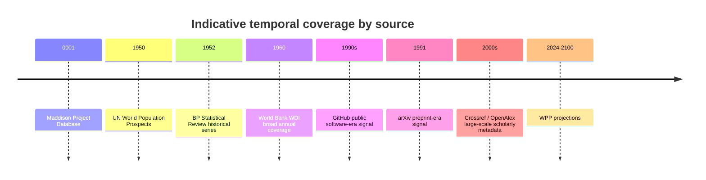

# Technical Data Source Connection Catalog

This document summarizes the public data sources considered for ContinuityBreakDetector. It focuses on integration reliability: official documentation, stable machine access, clear schemas, pagination behavior, licensing constraints, and operational risk.

## Executive Summary

The strongest sources for an automated continuity-break pipeline are World Bank WDI, OECD SDMX, OpenAlex, arXiv, Crossref, and Our World in Data Grapher. They provide documented public APIs or stable download patterns, with schemas clear enough for direct implementation.

Other sources remain analytically useful but require more integration caution: Maddison Project Database, Eurostat, GitHub, UN Population Division, BP / Energy Institute Statistical Review, IEA, and Dimensions. Their limitations are usually operational rather than analytical: file-based downloads, less stable URLs, web-oriented documentation, paid access, or partially documented machine endpoints.

When a detail was not explicitly found in official documentation, it is marked as `undocumented`.

## Quick Comparison

| Source | Access | Auth | Rate Limits | Main Format | Priority |
| --- | --- | --- | --- | --- | ---: |
| World Bank WDI | Free | None | Undocumented | JSON, XML, ZIP/CSV | 5 |
| OECD SDMX | Free | None | Documented, exact values not captured | SDMX-JSON, XML, CSV | 5 |
| OpenAlex | Free | Optional API key | 100 req/s; daily budget documented | JSON | 5 |
| arXiv API | Free | None | 1 request / 3 sec; single connection | Atom XML | 4 |
| BP / Energy Institute Statistical Review | Free | None | Undocumented | XLSX/PDF; CSV availability varies | 2 |
| IEA public aggregates | Freemium | Account/session for some products | Undocumented | Dotstat / downloadable files | 2 |
| GitHub public activity | Free | Optional token | Documented; inspect `/rate_limit` | JSON | 3 |
| Maddison Project Database | Free | None | None documented | XLSX, DTA, ZIP | 5 |
| UN Population Division API | Free | None | Undocumented | JSON, CSV | 3 |
| UN WPP bulk files | Free | None | None documented | CSV, XLSX | 5 |
| OWID Grapher API | Free | None | Undocumented | CSV, JSON, ZIP | 5 |
| Crossref REST API | Free / paid | None, `mailto`, or token | Public, polite, and plus tiers | JSON | 5 |
| Dimensions | Paid / partial public alternatives | Institutional | Undocumented publicly | DSL API / BigQuery open datasets | 1 |
| Eurostat | Free | None | Undocumented in retrieved snippets | JSON-stat, SDMX JSON/XML/CSV | 4 |

## Source Details

### World Bank WDI

TITLE: World Development Indicators API
NAME: World Bank
CATEGORY: economics / demographics / infrastructure
ACCESS_TYPE: free
LICENSE: `CC BY 4.0` plus World Bank dataset terms
API_AVAILABLE: yes
API_DOC_URL: `https://datahelpdesk.worldbank.org/knowledgebase/articles/889392-about-the-indicators-api-documentation`
BASE_URL: `https://api.worldbank.org/v2`
AUTHENTICATION: none
RATE_LIMITS: undocumented
PRIORITY_SCORE: 5

DESCRIPTION: Official World Bank API for WDI indicators and other indicator datasets. It exposes time-series observations, indicator metadata, and ZIP/CSV downloads.

IMPLEMENTATION_METHOD:

```text
REQUEST:
  GET https://api.worldbank.org/v2/country/all/indicator/SP.POP.TOTL?format=json&per_page=1000&page=1

RESPONSE:
  root[0] contains pagination metadata
  root[1][] contains indicator, country, year, value, unit, status, and precision fields

PAGINATION:
  loop page from 1 to root[0].pages

NORMALIZATION:
  - cast date to integer year for annual series
  - cast value to float
  - preserve nulls as null, not zero
  - use countryiso3code as the canonical geography key
```

DATA_QUALITY_NOTES: Long coverage, frequent null values, regular revisions, and some non-annual series. API sort order should not be treated as stable.

USE_CASE_FOR_CONTINUITY_BREAKS: Strong baseline source for regime changes in population, GDP, GDP per capita, urbanization, energy, and infrastructure.

### OECD SDMX

TITLE: OECD Data Explorer API
NAME: OECD
CATEGORY: economics / demographics / science / technology
ACCESS_TYPE: free
LICENSE: OECD terms and conditions
API_AVAILABLE: yes
API_DOC_URL: `https://www.oecd.org/en/data/insights/data-explainers/2024/09/api.html`
BASE_URL: `https://sdmx.oecd.org/public/rest`
AUTHENTICATION: none
RATE_LIMITS: documented, exact numeric values not captured
PRIORITY_SCORE: 5

DESCRIPTION: Official SDMX API for OECD data and structure queries. It supports CSV, JSON, and XML responses with dataset-specific dimensions.

IMPLEMENTATION_METHOD:

```text
DISCOVERY:
  GET https://sdmx.oecd.org/public/rest/dataflow/all

DATA REQUEST:
  GET /public/rest/data/{agency_id},{dataset_id},{version}/{selection}?startPeriod={start}&endPeriod={end}&format=csvfilewithlabels

NORMALIZATION:
  - query the structure before extracting data
  - preserve dataset-specific dimension order
  - parse yearly, quarterly, or monthly periods from the frequency dimension
  - store original dimension codes and labels
```

DATA_QUALITY_NOTES: Excellent structure, but each dataflow has its own dimensions. New dataflow versions may introduce incompatible schema changes.

USE_CASE_FOR_CONTINUITY_BREAKS: Useful for high-frequency economic, labor, price, production, R&D, and innovation signals.

### OpenAlex

TITLE: OpenAlex REST API
NAME: OpenAlex
CATEGORY: science / technology
ACCESS_TYPE: free
LICENSE: `CC0`
API_AVAILABLE: yes
API_DOC_URL: `https://developers.openalex.org/api-reference/introduction`
BASE_URL: `https://api.openalex.org`
AUTHENTICATION: optional free API key
RATE_LIMITS: `100 requests/second`; daily budget available from `/rate-limit`; `per_page` max `100`; cursor required beyond simple paging limits
PRIORITY_SCORE: 5

DESCRIPTION: Open catalog of global research metadata covering works, authors, sources, institutions, topics, and related entities.

IMPLEMENTATION_METHOD:

```text
LIST WORKS:
  GET https://api.openalex.org/works?filter=publication_year:2020&per_page=100&cursor=*

PAGINATION:
  start with cursor=*
  repeat with meta.next_cursor until exhausted

NORMALIZATION:
  - use publication_year as a partition column
  - retain OpenAlex ID and DOI separately
  - store cited_by_count as a current snapshot metric, not a historical citation count
  - flatten authorships to child tables when needed
```

DATA_QUALITY_NOTES: Excellent coverage. `cited_by_count` is a current snapshot, so historical citation analyses require snapshots or repeated captures.

USE_CASE_FOR_CONTINUITY_BREAKS: Measures scientific production growth, topic diversification, institutional diffusion, and technology-related research waves.

### arXiv

TITLE: arXiv API
NAME: arXiv
CATEGORY: science / technology
ACCESS_TYPE: free
LICENSE: reusable metadata; content licenses vary by article
API_AVAILABLE: yes
API_DOC_URL: `https://info.arxiv.org/help/api/user-manual.html`
BASE_URL: `http://export.arxiv.org/api`
AUTHENTICATION: none
RATE_LIMITS: one request every three seconds; one connection at a time; `max_results` limits apply
PRIORITY_SCORE: 4

DESCRIPTION: Legacy search and metadata API returning Atom XML. arXiv recommends OAI-PMH for large metadata harvests.

IMPLEMENTATION_METHOD:

```text
SEARCH:
  GET http://export.arxiv.org/api/query?search_query=all:electron&start=0&max_results=2000&sortBy=submittedDate&sortOrder=ascending

PAGINATION:
  increment start by max_results
  stop when returned entries are exhausted
  sleep between calls

NORMALIZATION:
  - parse published and updated timestamps
  - normalize arXiv ID from entry URL
  - keep primary_category as the main subject code
  - keep DOI nullable
```

DATA_QUALITY_NOTES: Strong early signal for scientific diffusion, but taxonomy is arXiv-specific and full-text licenses are not uniform.

USE_CASE_FOR_CONTINUITY_BREAKS: Detects early waves in preprints, especially in physics, mathematics, computer science, and AI.

### BP / Energy Institute Statistical Review

TITLE: Statistical Review of World Energy data files
NAME: BP legacy site / Energy Institute
CATEGORY: energy
ACCESS_TYPE: free
LICENSE: undocumented in retrieved official pages
API_AVAILABLE: no
API_DOC_URL: `https://www.bp.com/en/global/corporate/energy-economics.html`
BASE_URL: undocumented
AUTHENTICATION: none
RATE_LIMITS: undocumented
PRIORITY_SCORE: 2

DESCRIPTION: Historical energy reference series from BP through 2022, with continuity now handled by the Energy Institute. The retrieved official pages do not expose a stable public machine API.

IMPLEMENTATION_METHOD:

```text
WORKFLOW:
  1. open the official landing page
  2. locate the latest Statistical Review data file
  3. prefer XLSX or ZIP when available
  4. store raw files with release metadata and checksum
  5. convert workbook tabs to normalized CSV or Parquet

NORMALIZATION:
  - release_year, sheet_name, entity, year, variable, value, unit
  - preserve original sheet names
  - document BP to Energy Institute lineage
```

DATA_QUALITY_NOTES: High analytical value for fossil fuels, electricity, and primary energy. Operational risk is higher because official machine access is not API-first.

USE_CASE_FOR_CONTINUITY_BREAKS: Useful for long-run energy consumption, renewables growth, substitution effects, and material constraints behind economic acceleration.

### IEA Public Aggregates

TITLE: IEA public data products and free aggregates
NAME: International Energy Agency
CATEGORY: energy
ACCESS_TYPE: freemium
LICENSE: undocumented in retrieved official pages
API_AVAILABLE: no stable unauthenticated endpoint captured
API_DOC_URL: `https://www.iea.org/data-and-statistics/data-product/world-energy-balances`
BASE_URL: undocumented
AUTHENTICATION: account or web session for some free datasets
RATE_LIMITS: undocumented
PRIORITY_SCORE: 2

DESCRIPTION: Structured IEA data products, some free but often behind account or Dotstat access. Official pages describe products more clearly than stable unauthenticated endpoints.

IMPLEMENTATION_METHOD:

```text
WORKFLOW:
  1. access product page
  2. follow Dotstat or approved download flow
  3. store downloaded artifacts verbatim
  4. pin raw files by release date and checksum
  5. normalize product, scenario, entity, year, variable, value, and unit
```

DATA_QUALITY_NOTES: Very high quality energy data, but public access varies by product. Treat as artifact-based ingestion unless a stable endpoint is confirmed.

USE_CASE_FOR_CONTINUITY_BREAKS: Useful for energy intensity, energy mix, scenario changes, and energy/GDP decoupling.

### GitHub Public Activity

TITLE: GitHub REST API for public repository activity
NAME: GitHub
CATEGORY: technology
ACCESS_TYPE: free
LICENSE: subject to GitHub terms
API_AVAILABLE: yes
API_DOC_URL: `https://docs.github.com/en/rest`
BASE_URL: `https://api.github.com`
AUTHENTICATION: none for many public endpoints; token optional for higher limits
RATE_LIMITS: documented by GitHub; inspect `/rate_limit` and response headers at runtime
PRIORITY_SCORE: 3

DESCRIPTION: Versioned REST API covering public events, commits, repository metadata, and selected repository statistics.

IMPLEMENTATION_METHOD:

```text
PUBLIC EVENTS:
  GET https://api.github.com/events?per_page=100&page=1

REPO COMMITS:
  GET https://api.github.com/repos/{owner}/{repo}/commits?per_page=100&page=1

RATE STATUS:
  GET https://api.github.com/rate_limit

NORMALIZATION:
  - follow Link pagination headers
  - retry HTTP 202 repository statistics after delay
  - store raw event payloads separately from derived aggregates
```

DATA_QUALITY_NOTES: Strong technology signal, but global coverage requires careful repository sampling or search strategies. Traffic endpoints are not suitable for open global studies.

USE_CASE_FOR_CONTINUITY_BREAKS: Proxy for software production activity, ecosystem diffusion, and nonlinear changes in specific technology families.

### Maddison Project Database

TITLE: Maddison Project Database 2023
NAME: Groningen Growth and Development Centre / DataverseNL
CATEGORY: economics
ACCESS_TYPE: free
LICENSE: `CC BY 4.0` with citation requirements for specific uses
API_AVAILABLE: no
API_DOC_URL: `https://www.rug.nl/ggdc/historicaldevelopment/maddison/releases/maddison-project-database-2023?lang=en`
BASE_URL: `https://dataverse.nl/dataset.xhtml?persistentId=doi:10.34894/INZBF2`
AUTHENTICATION: none
RATE_LIMITS: none documented
PRIORITY_SCORE: 5

DESCRIPTION: Long-run historical GDP, GDP per capita, and population database distributed through Dataverse and GGDC pages as Excel and Stata files.

IMPLEMENTATION_METHOD:

```text
WORKFLOW:
  1. download XLSX or DTA release files
  2. preserve source sheet and metadata sheet separately
  3. convert to long Parquet
  4. freeze release version in metadata

NORMALIZATION:
  - entity, iso3, year, variable, value, release_version, raw_source_file
  - preserve original variable names from the workbook
```

DATA_QUALITY_NOTES: Essential for long horizons, but reconstructed and revised. Treat as scholarly estimates, not raw observations.

USE_CASE_FOR_CONTINUITY_BREAKS: Tests whether contemporary acceleration is unusual at century-scale or millennial-scale horizons.

### UN Population Division API

TITLE: UN Population Division Data Portal API
NAME: United Nations Population Division
CATEGORY: demographics
ACCESS_TYPE: free
LICENSE: dataset-specific license not fully captured in retrieved snippets
API_AVAILABLE: yes
API_DOC_URL: `https://population.un.org/dataportalapi/index.html`
BASE_URL: `https://population.un.org/dataportalapi/api/v1`
AUTHENTICATION: none
RATE_LIMITS: undocumented
PRIORITY_SCORE: 3

DESCRIPTION: Data portal API exposing indicator lists and data retrieval by indicator, location, year, age, variant, sex, and category. Some documentation is rendered client-side.

IMPLEMENTATION_METHOD:

```text
DISCOVER INDICATORS:
  GET https://population.un.org/dataportalapi/api/v1/indicators?format=csv&sort=name

WORKFLOW:
  1. fetch indicator catalog
  2. select indicator IDs
  3. build data requests from the interactive API documentation
  4. ingest JSON or CSV responses

NORMALIZATION:
  - indicator_id, indicator_label, location, year, age, sex, variant, category, value
  - keep estimate/projection variants explicit
```

DATA_QUALITY_NOTES: High scientific value, but static documentation is less complete than World Bank or OpenAlex. Validate request templates manually before automating.

USE_CASE_FOR_CONTINUITY_BREAKS: Demographic regime changes, fertility transitions, aging, age-structure shocks, and regional synchronization.

### UN World Population Prospects Bulk Files

TITLE: World Population Prospects bulk downloads
NAME: United Nations Population Division
CATEGORY: demographics
ACCESS_TYPE: free
LICENSE: `CC BY 3.0 IGO` visible for methodology materials; dataset-specific bulk file license should be verified
API_AVAILABLE: no
API_DOC_URL: `https://population.un.org/wpp/`
BASE_URL: `https://population.un.org/wpp/`
AUTHENTICATION: none
RATE_LIMITS: none documented
PRIORITY_SCORE: 5

DESCRIPTION: WPP 2024 provides CSV bulk files suitable for database and statistical software use. This is the most robust UN population path for batch ingestion.

IMPLEMENTATION_METHOD:

```text
WORKFLOW:
  1. use WPP download section
  2. choose CSV bulk files
  3. download metadata workbooks for location and aggregate mappings
  4. ingest as release-pinned long tables

NORMALIZATION:
  - entity_code, sex, variant, age_group, year, value, unit, release
  - keep historical estimates and projection variants separate
```

DATA_QUALITY_NOTES: Global official reference, but partly projection-based. Variant handling must be explicit in the schema.

USE_CASE_FOR_CONTINUITY_BREAKS: Population acceleration, deceleration, reversal, and regional synchronization from 1950 through projections.

### Our World in Data Grapher API

TITLE: OWID Grapher Chart API
NAME: Our World in Data
CATEGORY: energy / science / demographics / economics
ACCESS_TYPE: free
LICENSE: `CC BY 4.0` at API level; some non-redistributable assets return `403`
API_AVAILABLE: yes
API_DOC_URL: `https://docs.owid.io/projects/etl/api/chart-api/`
BASE_URL: `https://ourworldindata.org`
AUTHENTICATION: none
RATE_LIMITS: undocumented
PRIORITY_SCORE: 5

DESCRIPTION: Simple chart-level API. Each Grapher chart can usually be requested as `.csv`, `.metadata.json`, or `.zip`.

IMPLEMENTATION_METHOD:

```text
CSV:
  GET https://ourworldindata.org/grapher/{slug}.csv

METADATA:
  GET https://ourworldindata.org/grapher/{slug}.metadata.json

NORMALIZATION:
  - Entity, Code, Year, variable, value
  - attach metadata JSON to the dataset registry
  - treat 403 as a non-redistributable asset and skip
```

DATA_QUALITY_NOTES: Very easy ingestion, but many OWID series are processed versions of external sources. Always preserve metadata for original source, unit, and processing notes.

USE_CASE_FOR_CONTINUITY_BREAKS: Fast experiments on energy, publications, internet, CO2, health, demographics, and already harmonized long-run indicators.

### Crossref REST API

TITLE: Crossref REST API
NAME: Crossref
CATEGORY: science
ACCESS_TYPE: free / paid
LICENSE: Crossref documentation states that most metadata is not subject to copyright; abstracts may have separate rights
API_AVAILABLE: yes
API_DOC_URL: `https://www.crossref.org/documentation/retrieve-metadata/rest-api/`
BASE_URL: `https://api.crossref.org/v1`
AUTHENTICATION: none, `mailto`, or Plus API token
RATE_LIMITS: public, polite, and plus tiers with different request and concurrency limits
PRIORITY_SCORE: 5

DESCRIPTION: Public REST API for scholarly metadata, including DOIs, document types, creation/update dates, links, and reference/citation-related fields.

IMPLEMENTATION_METHOD:

```text
BASIC LIST:
  GET https://api.crossref.org/v1/works?rows=1000&filter=from-created-date:2020-01-01,until-created-date:2020-12-31&mailto=you@example.org

CURSOR PAGING:
  start with cursor=*
  repeat with returned cursor

NORMALIZATION:
  - store DOI in normalized lowercase form
  - preserve title arrays and raw JSON
  - normalize date-parts with partial-date handling
  - keep abstracts and links null-safe
```

DATA_QUALITY_NOTES: Huge coverage, but metadata quality depends on member deposits. Strong for counting and filtering DOI activity; weaker if uniform field quality is assumed.

USE_CASE_FOR_CONTINUITY_BREAKS: Formal scholarly activity, document type shifts, DOI growth, and complementing OpenAlex and arXiv.

### Dimensions

TITLE: Dimensions Analytics API / Open datasets note
NAME: Dimensions
CATEGORY: science
ACCESS_TYPE: paid / partial public alternatives
LICENSE: undocumented in retrieved official snippets
API_AVAILABLE: yes, subscription-only for the Analytics API
API_DOC_URL: `https://docs.dimensions.ai/dsl/api.html`
BASE_URL: undocumented in retrieved public snippets
AUTHENTICATION: institutional access
RATE_LIMITS: undocumented publicly
PRIORITY_SCORE: 1

DESCRIPTION: Dimensions Analytics API is subscription-only. Some open datasets may be available in BigQuery, but that is not the same as a public REST API.

IMPLEMENTATION_METHOD:

```text
DECISION:
  if no institutional subscription:
    do not build a default Dimensions connector
    use OpenAlex, Crossref, and arXiv instead

OPTIONAL PATH:
  keep behind a feature flag such as DIMENSIONS_ENABLED=false
```

DATA_QUALITY_NOTES: Valuable for grants, funding, citations, and institutional analysis, but not suitable as a default open-source connector without access.

USE_CASE_FOR_CONTINUITY_BREAKS: Useful only when institutional access is already available.

### Eurostat

TITLE: Eurostat APIs
NAME: Eurostat
CATEGORY: economics / demographics / energy / industry
ACCESS_TYPE: free
LICENSE: generally free reuse for Eurostat data, except third-party or specially restricted datasets
API_AVAILABLE: yes
API_DOC_URL: `https://ec.europa.eu/eurostat/web/user-guides/data-browser/api-data-access/api-getting-started`
BASE_URL: `https://ec.europa.eu/eurostat/api/dissemination`
AUTHENTICATION: none
RATE_LIMITS: undocumented in retrieved snippets
PRIORITY_SCORE: 4

DESCRIPTION: Eurostat exposes free data and metadata APIs, including JSON-stat 2.0 and SDMX families.

IMPLEMENTATION_METHOD:

```text
WORKFLOW:
  1. use Data Browser or API guide to generate an initial query
  2. ingest JSON-stat 2.0 or SDMX responses
  3. parse dimensions, categories, values, units, and status fields
  4. store code lists as metadata tables

NORMALIZATION:
  dataset_code, dimension_name, dimension_value, time_period, value, unit, status
```

DATA_QUALITY_NOTES: Rich and high quality, but integration is more technical if JSON-stat and SDMX are both supported. Datasets can update frequently.

USE_CASE_FOR_CONTINUITY_BREAKS: Regional European breaks in industry, demographics, trade, energy, transport, prices, and labor markets.

## Coverage Timeline

The most useful long-horizon sources cover different periods. Maddison reaches farthest back historically; WDI is broad from around 1960; WPP covers 1950 through projections; BP/Energy Institute covers modern energy history; OpenAlex, Crossref, and arXiv cover modern scholarly activity.



## Open Questions and Limits

- GitHub can be integrated cleanly, but exact core and search limits should be captured at runtime through `/rate_limit` and response headers.
- Eurostat API families are documented, but the safest first connector path is to generate a concrete query from the Data Browser, then generalize it.
- IEA and the post-BP Statistical Review should be treated as artifact-download sources unless a stable public machine endpoint is confirmed.
- For the UN Population Division, WPP bulk files are more reliable for first automation than the interactive API.
- Any new connector should record source URL, retrieval time, license notes, release version, checksum where applicable, and raw schema snapshot.
